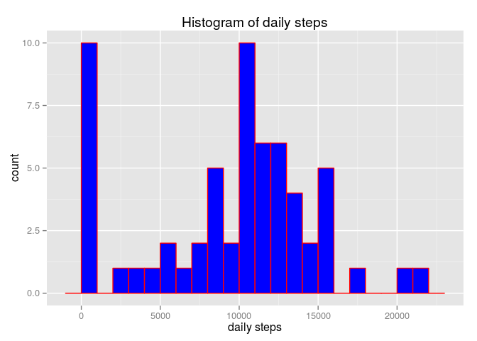
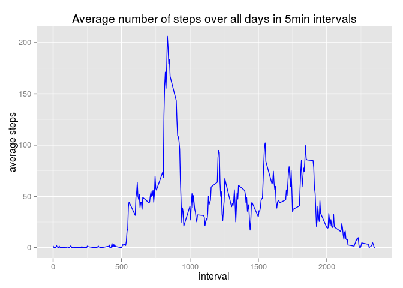
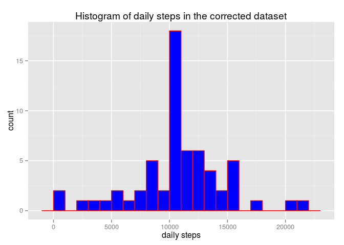
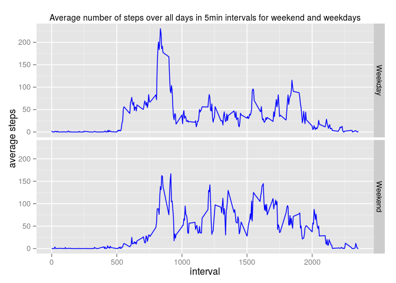

# Reproducible Research, Project 1
November 11, 2015  

In this project for Reproducible Research course on Coursera, the data from a personal activity monitoring device collected during the months of October and November was analyzed. The data visualization was used to answer some questions. The data was 
downloaded through the Coursera website using the following link (https://d396qusza40orc.cloudfront.net/repdata%2Fdata%2Factivity.zip). The unzip file contains the data in a `CSV` format file.


```r
setwd("/home/salk/Dropbox/ReproducibleResearch/Projects/Project1/")
unzip("/home/salk/Dropbox/ReproducibleResearch/Projects/Project1/repdata_data_activity.zip", exdir="./")
list.files()
```

```
## [1] "activity.csv"              "Project1.html"            
## [3] "Project1.Rmd"              "repdata_data_activity.zip"
```

The `CSV` file was read into R for further analysis:

```r
Dataset <- read.csv("activity.csv", header=TRUE)
```

What is mean total number of steps taken per day?
==============================================================

In the first exercise, we are adding up the number of steps for each day:


```r
library(plyr)
TotalDailySteps<-ddply(Dataset, .(date), summarise, total_daily_step=sum(steps, na.rm=TRUE))
```

A histogram  of total number of steps per day is shown below: 


```r
#hist(TotalDailySteps$total_daily_step, breaks=20, col="blue")
library(ggplot2)
ggplot(data = TotalDailySteps, aes(total_daily_step))+geom_histogram(binwidth=1000, fill=I("blue"), col=I("red"))+ggtitle("Histogram of daily steps")+xlab("daily steps")
```



The mean and median of the total daily steps are:

```r
mean(TotalDailySteps$total_daily_step, na.rm = T)
```

```
## [1] 9354.23
```

```r
median(TotalDailySteps$total_daily_step, na.rm = T)
```

```
## [1] 10395
```

What is the average daily activity pattern?
==========================================================

The time series of the number of steps in intervals of 5 minutes averaged over all days: 


```r
TimeSeries <- aggregate(x = list(average_steps=Dataset$steps), by=list(interval=Dataset$interval), mean, na.rm=TRUE)
head(TimeSeries)
```

```
##   interval average_steps
## 1        0     1.7169811
## 2        5     0.3396226
## 3       10     0.1320755
## 4       15     0.1509434
## 5       20     0.0754717
## 6       25     2.0943396
```

```r
ggplot(data=TimeSeries, aes(interval, average_steps))+geom_line(col=I("blue"))+
  ggtitle("Average number of steps over all days in 5min intervals")+ylab("average steps")
```



The maximum number of steps can be taken during 5 minutes can be found using:


```r
TimeSeries[which.max(TimeSeries$average_steps), ]
```

```
##     interval average_steps
## 104      835      206.1698
```

Imputing missing values
===========================================================
The total number of missing step values is: 

```r
TotalNA<-sum(is.na(Dataset$steps))
TotalNA
```

```
## [1] 2304
```
The percentage of the missing rows is:


```r
TotalNA/dim(Dataset)[1]*100
```

```
## [1] 13.11475
```

The `NA` values in the original datasets can be filled with the calculated mean of steps in 
5min intervals averaged over all days. The mean values were previously calculated in the 
variable "TimeSeries":


```r
fillMissing <- function(steps, interval)
{
  CorrectedSteps<-c()
  if(is.na(steps))
        {CorrectedSteps <- TimeSeries[TimeSeries$interval==interval, 2]}
    else
    {CorrectedSteps <- steps}
  }


CorrectedDataset <- Dataset
#applying the function fillMissing
CorrectedDataset$steps<-mapply(fillMissing, Dataset$steps, Dataset$interval)
head(CorrectedDataset)
```

```
##       steps       date interval
## 1 1.7169811 2012-10-01        0
## 2 0.3396226 2012-10-01        5
## 3 0.1320755 2012-10-01       10
## 4 0.1509434 2012-10-01       15
## 5 0.0754717 2012-10-01       20
## 6 2.0943396 2012-10-01       25
```

The next steps is to look at the mean and median of daily number of steps in the `CorrectedDataset` and compare
them with those calculated for the original `Dataset` in the first section.


```r
TotalDailyStepsCorrectedData<-ddply(CorrectedDataset, .(date), summarise, total_daily_step=sum(steps, na.rm=TRUE))
head(TotalDailyStepsCorrectedData)
```

```
##         date total_daily_step
## 1 2012-10-01         10766.19
## 2 2012-10-02           126.00
## 3 2012-10-03         11352.00
## 4 2012-10-04         12116.00
## 5 2012-10-05         13294.00
## 6 2012-10-06         15420.00
```


```r
#hist(TotalDailySteps$total_daily_step, breaks=20, col="blue")
library(ggplot2)
ggplot(data = TotalDailyStepsCorrectedData, aes(total_daily_step))+geom_histogram(binwidth=1000, fill=I("blue"), col=I("red"))+ggtitle("Histogram of daily steps in the corrected dataset")+xlab("daily steps")
```



The mean and median of the total daily steps in the corrected dataset are:

```r
mean(TotalDailyStepsCorrectedData$total_daily_step, na.rm = T)
```

```
## [1] 10766.19
```

```r
median(TotalDailyStepsCorrectedData$total_daily_step, na.rm = T)
```

```
## [1] 10766.19
```

In the original dataset there were missing step values for  some intervals such as those reported for `2012-10-01` that were mapped to zero in the total daily steps calculation by default. In the corrected data set, the `NA` values were substituted with the average
of the steps in all days for the same interval that resulted in less zero counts in the plotted histogram for the corrected dataset.  

Are there differences in activity patterns between weekdays and weekends?
========================================================================

First the date associated with each measurement should be changed to weekdays using the function `weekdays()` and 


```r
AddedFactorToCorrectedDS<-mutate(CorrectedDataset, factor=weekdays(as.Date(CorrectedDataset$date)))
head(AddedFactorToCorrectedDS)
```

```
##       steps       date interval factor
## 1 1.7169811 2012-10-01        0 Monday
## 2 0.3396226 2012-10-01        5 Monday
## 3 0.1320755 2012-10-01       10 Monday
## 4 0.1509434 2012-10-01       15 Monday
## 5 0.0754717 2012-10-01       20 Monday
## 6 2.0943396 2012-10-01       25 Monday
```

The weekdays are mapped to two categories of weekend and weekend using the following function and the categorized activity data are plotted in time series format. 


```r
ModifyFacor <- function(factor)
  {
    NewFactor <- c()
    if (factor %in% c("Sunday", "Saturday"))
      {NewFactor ="Weekend"} 
    else 
    {NewFactor ="Weekday"}
  return(NewFactor)
}
CategorizedCorrectedData<-mapply(ModifyFacor, AddedFactorToCorrectedDS$factor)
DataWeekdayWeekend<-cbind(AddedFactorToCorrectedDS, factor2=CategorizedCorrectedData)
#
TimeSeriesWeekdayWeekend <- aggregate(steps~interval+factor2, data=DataWeekdayWeekend, mean, na.rm=TRUE)
head(TimeSeriesWeekdayWeekend)
```

```
##   interval factor2      steps
## 1        0 Weekday 2.25115304
## 2        5 Weekday 0.44528302
## 3       10 Weekday 0.17316562
## 4       15 Weekday 0.19790356
## 5       20 Weekday 0.09895178
## 6       25 Weekday 1.59035639
```

```r
ggplot(data=TimeSeriesWeekdayWeekend, aes(interval, steps))+geom_line(colour=c("blue"))+facet_grid(factor2~.)+ylab("average steps")+ggtitle("Average number of steps over all days in 5min intervals for weekend and weekdays")+theme(plot.title = element_text(size=10.5))
```



